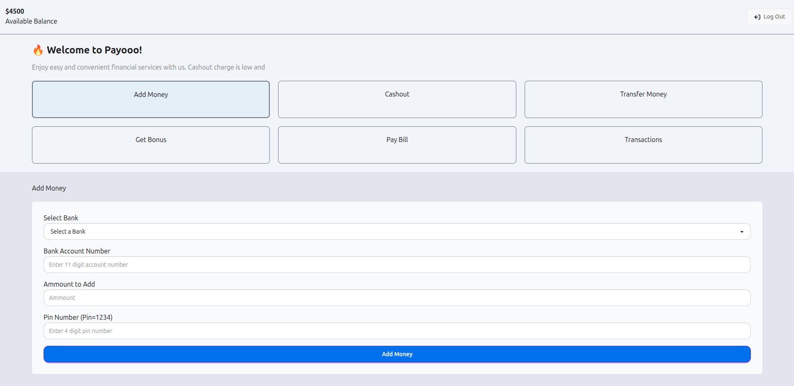

    # 💳 Payoo – Digital Payment System

Payoo is a simple **digital payment system (MFS-style)** web application built with **HTML, CSS, Tailwind, and JavaScript**.  
It allows users to **log in, transfer money, check transaction history, and manage their balance** in a clean and responsive UI.

---

## 🌐 Live Demo

🔗 [Click here to try Payoo](https://farhanahmedanik59.github.io/Payoo-project/)

---

## 📸 Preview

## ✨ Features

- 🔑 **User Login System** – Secure login with number & PIN.
- 💸 **Add & Transfer Money** – Manage balance easily.
- 📜 **Transaction History** – See all previous transactions.
- 📱 **Responsive Design** – Works smoothly on desktop and mobile.
- 🎨 **Modern UI** – Styled with Tailwind CSS and DaisyUI.

---

## 🛠️ Tech Stack

- **Frontend:** HTML, CSS, JavaScript
- **Frameworks/Libraries:** Tailwind CSS, DaisyUI
- **Hosting:** GitHub Pages

---

## 🚀 How to Use

1. Open the [live link](https://farhanahmedanik59.github.io/Payoo-project/).
2. Log in with your number and PIN.
3. Add or transfer money.
4. View your transaction history.

---
